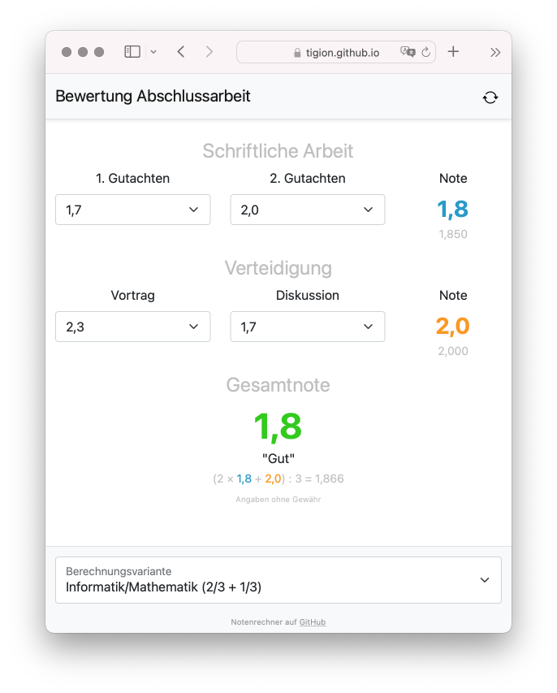

# Notenrechner

Web application for calculating the assessment of final theses.
Optimized for mobile devices.

- Try it as a [GitHub Page](https://tigion.github.io/htwd-project-grade-calculator/)

## Notes

The calculation is performed as an integer, with three decimal places, in the
JavaScript classes `Calculation` and `Grade`.
The interface is implemented with HTML/CSS and Bootstrap (CSS).

### Calculation

| Partial Grade       |  Calculation                        |
| ------------------- | ----------------------------------- |
| Schriftliche Arbeit | `(2. Gutachten + 2. Gutachten) / 2` |
| Verteidigung        | `(Vortrag + Diskussion) / 3`        |

| Final Grade                                |  Calculation                                   |
| ------------------------------------------ | ---------------------------------------------- |
| Informatik/Mathematik (3/3 + 1/3)     | `(2x Schriftliche Arbeit + Verteidigung) / 3`  |
| Wirtschaftswissenschaften (4/4 + 1/4) | `(3x Schriftliche Arbeit + Verteidigung) / 4`  |

- For the partial grades (**Schriftliche Arbeit**, **Verteidigung** and
  **Gesamtnoten**), everything after the first decimal place is cut off in the
  result. The uncut result is displayed below the grades for control purposes.
